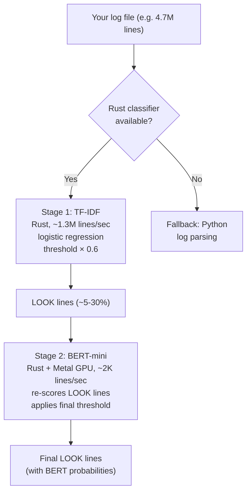
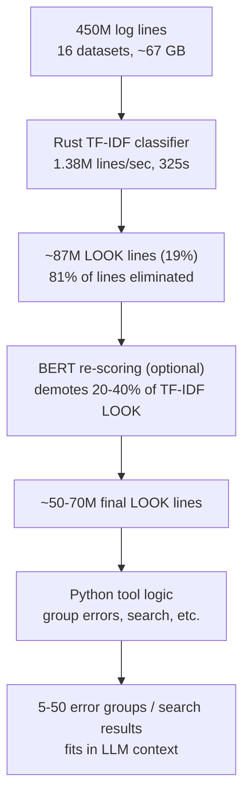

# log-mcp

MCP server for log file analysis. Gives LLMs the ability to efficiently analyze large log files without loading them into context.

A Rust-based ML classifier pre-filters log lines at 1.3M lines/sec (TF-IDF), optionally refined by BERT-mini on Metal GPU at ~2K lines/sec on the LOOK subset. Only the interesting 5-30% reach Python for parsing and grouping. This makes tools like `analyze_errors` and `search_logs` practical on files with millions of lines — the classifier handles the I/O-bound scan, Python handles the logic on the reduced set.

This is a tool designed for AI, not humans. No human reads the output of `analyze_errors` or `compare_logs` — Claude does, compresses it further, and gives the human a plain English answer. The human touches two endpoints: "what's wrong with this log?" in, natural language answer out. Everything in between is AI talking to itself.

## Tools

| Tool | Description |
|------|-------------|
| `log_overview` | Quick scan: size, line count, time range, level distribution, head/tail samples |
| `search_logs` | Search by regex, log level, and/or time range |
| `get_log_segment` | Extract a segment by line range or time range |
| `analyze_errors` | Deduplicate errors by fingerprint, count frequencies, extract stack traces |
| `log_stats` | Volume histogram, level breakdown, top repeated patterns |
| `compare_logs` | Find patterns unique to each file and frequency outliers across files |
| `classify_lines` | ML classifier (TF-IDF → BERT) separates interesting lines from noise |

## Key features

- **ML pre-filter** — a Rust TF-IDF classifier scans files at 1.3M lines/sec, so `analyze_errors` and `search_logs` only process the 5-30% of lines that matter. Optional BERT-mini re-scores LOOK lines at ~2K lines/sec on Metal GPU for higher precision. Works without parsed log levels — catches errors, security events, hardware faults, and anomalies that don't have ERROR in them.
- **Auto-detection** of log formats: JSON, standard text (`2024-01-15 10:30:45 ERROR ...`), syslog, Spark/Log4j (`17/06/08 13:33:49 INFO ...`), and tab/pipe-delimited formats (GitHub Actions CI logs)
- **Normalization** collapses variable parts (UUIDs, hex IDs, IPs, numbers) so that messages differing only in IDs or timestamps are grouped as the same pattern
- **Content-based error detection** falls back to regex heuristics (`fatal:`, `Permission denied`, `##[error]`, etc.) when log files lack standard levels
- **Prefix-aware comparison** distinguishes patterns from different job steps in CI logs

## Install

**Prerequisites** (fresh Mac):
```bash
brew install python uv
curl --proto '=https' --tlsv1.2 -sSf https://sh.rustup.rs | sh
```

### Just ask Claude

Open a Claude Code session and paste this prompt:

```
Install https://github.com/ascii766164696D/log-mcp as an MCP server and build the Rust classifier too
```

Claude will clone the repo, register the MCP server, and build the Rust classifier. Restart Claude Code after to pick up the new server.

### Manual install

```bash
git clone https://github.com/ascii766164696D/log-mcp.git
cd log-mcp

# Register the MCP server
claude mcp add log-mcp -- uv run --directory $(pwd) log-mcp

# Build the Rust classifier (optional — tools fall back to Python without it)
uv pip install -e rust/classifier
```

Or add it manually to your project settings (`claude settings`) under `mcpServers`:

```json
{
  "mcpServers": {
    "log-mcp": {
      "command": "uv",
      "args": ["run", "--directory", "/path/to/log-mcp", "log-mcp"]
    }
  }
}
```

### Claude Desktop

Open **Settings > Developer > Edit Config** and add to `claude_desktop_config.json`:

```json
{
  "mcpServers": {
    "log-mcp": {
      "command": "uv",
      "args": ["run", "--directory", "/path/to/log-mcp", "log-mcp"]
    }
  }
}
```

Replace `/path/to/log-mcp` with the actual path where you cloned this repo. Restart Claude Desktop after saving.

The Rust classifier requires a Rust toolchain to build. The BERT stage additionally requires a Metal-capable GPU (Apple Silicon). All tools work without the classifier — they fall back to Python log parsing.

## Example usage

Analyze errors in a 67MB Spark executor log (705K lines):

```
> analyze_errors("/var/log/spark/container_0002_01_000004.log")

Summary: 34 errors in 5 groups.
Top: 'shuffle.RetryingBlockFetcher: Exception while beginning fetch of <N>
outstanding blocks (after <N> retries) ...' (18x)

--- 18x ---
Fingerprint: shuffle.RetryingBlockFetcher: Exception while beginning fetch of <N> outstanding blocks ...
First: L29764 2017-02-01T15:55:17
Last:  L30677 2017-02-01T15:55:51
Stack trace:
  java.io.IOException: Failed to connect to mesos-slave-13/10.10.34.23:55492
  ...
```

Compare two CI log files:

```
> compare_logs(["run_a.txt", "run_b.txt"])

699 patterns across 2 files (0 shared).
A: 401 unique (top: 'test / test UNKNOWN STEP | ##[endgroup]' 21x)
B: 298 unique (top: 'test UNKNOWN STEP | ##[endgroup]' 21x)
```

## Claude's take

*I helped build this tool and then used it to analyze real log files, so here's my honest assessment.*

**Where it genuinely helps:** The main value is as a compression layer. A 67MB Spark log (705K lines) would obliterate my context window, but `analyze_errors` distills it into 5 error groups with stack traces in a few seconds. `compare_logs` across two 1500-line server logs immediately surfaces which errors are unique to each server and which patterns have suspicious frequency differences. I couldn't do that by reading the files directly — I'd lose older content as new content scrolled in.

**Where it's a wash:** For small files (under a few hundred lines), you're better off just pasting the log into the conversation. The tools add indirection without much benefit when the whole file fits in context anyway.

**What it can't do:** It won't catch issues that require domain understanding. When I analyzed a Zookeeper log, the tools correctly found the `ERROR` entries, but the most operationally interesting signals — state transitions between LOOKING, FOLLOWING, and LEADING — were all `INFO` level and invisible to error analysis. A human who knows Zookeeper would spot those immediately. The tools find what's syntactically wrong, not what's semantically wrong.

**The pattern I landed on:** Start with `log_overview` to get bearings, then `analyze_errors` for the quick wins, then `search_logs` to dig into specific patterns that look suspicious. `compare_logs` is most useful when you have a "working" and "broken" run to diff against each other.

## LOOK/SKIP classifier

The `classify_lines` tool uses a two-stage ML pipeline to separate interesting log lines (LOOK) from routine noise (SKIP), without needing parsed log levels.

### How it works



On a Thunderbird HPC log (2K lines), this finds **92 interesting lines** including sendmail DNS failures, DHCP lease errors, and Ganglia RRD update collisions — none of which have a standard ERROR log level. A `search_logs level=ERROR` on the same file returns only 2 lines.

### What it catches beyond log levels

| Signal type | Example | Has ERROR level? |
|---|---|---|
| DNS misconfiguration | `unable to qualify my own domain name` | No |
| Mail delivery failure | `stat=Deferred: Connection refused` | No |
| DHCP lease errors | `unknown lease 10.100.4.251` | No |
| Monitoring data corruption | `illegal attempt to update using time X when last update time is X` | No |
| Negative boot times | `Times: total = 42, boot = -4131` | No |
| Auth failures | `authentication failure; logname= uid=0` | No |
| Hardware errors | `instruction cache parity error corrected` | No (INFO level) |

### Tools that use the classifier

| Tool | How | Fallback |
|---|---|---|
| `classify_lines` | Full pipeline: TF-IDF → BERT | Error if classifier not installed |
| `analyze_errors` | TF-IDF pre-filters to LOOK lines, then groups by error fingerprint | Python parser scans all lines |
| `search_logs` | TF-IDF pre-filters when searching for errors (level=ERROR, pattern=error/fail/etc) | Python parser scans all lines |

## Benchmarks

Evaluated on the full [Loghub](https://github.com/logpai/loghub) dataset — 450 million lines across 16 log sources — on an Apple M3 Ultra (32 cores).

### TF-IDF classifier (Rust)

| Dataset | Lines | Time | Speed | LOOK % | Error capture |
|---|---|---|---|---|---|
| Thunderbird | 211M | 139s | 1.52M/s | 30% | 100% |
| Windows | 115M | 90s | 1.27M/s | 1% | 100% |
| HDFS_v2 | 71M | 59s | 1.21M/s | 20% | 100% |
| Spark | 33M | 23s | 1.44M/s | 12% | 100% |
| HDFS | 11M | 7s | 1.62M/s | 3% | 100% |
| BGL | 4.7M | 3.3s | 1.46M/s | 42% | 98.6% |
| Android | 1.6M | 1.1s | 1.37M/s | 12% | 100% |
| SSH | 655K | 0.5s | 1.47M/s | 90% | 100% |
| **Total** | **450M** | **325s** | **1.38M/s** | | **99.95%** |

Error capture = percentage of lines with ERROR/FATAL level that the classifier marks as LOOK. At threshold 0.3, the classifier catches 99.95% of all error lines (35.9M of 35.9M) and 100% of warning lines (14.3M of 14.3M). The 0.05% "missed" errors are lines like BGL's repetitive `instruction cache parity error corrected` — routine hardware telemetry that happens to carry ERROR level but isn't operationally interesting. The classifier learned to skip these.

### Model accuracy

| Model | Metric | Score |
|---|---|---|
| TF-IDF + LogReg | Best CV LOOK F1 | 0.792 |
| TF-IDF + LogReg | LOOK precision | 0.892 |
| BERT-mini | Overall accuracy | 0.849 |
| BERT-mini | LOOK F1 | 0.887 |

TF-IDF model evaluated with GroupKFold cross-validation (holdout: BGL, Thunderbird). BERT-mini fine-tuned on 4 layers, 256 hidden, 11M params.

### End-to-end reduction



## Retraining with your own logs

The classifier ships pre-trained, but you can retrain it on your own logs. The short version:

```bash
# 1. Add your logs
head -2000 /var/log/myapp/app.log > data/loghub/MyApp_2k.log

# 2. Label with Claude (Batch API, ~$0.10-0.50 per file)
export ANTHROPIC_API_KEY=sk-ant-...
uv sync --group labeling --group training
uv run python -m scripts.labeling.label_new

# 3. Train and export
uv run --group training python -m scripts.labeling.train_model
uv run --group training python -m scripts.labeling.export_model

# 4. Rebuild Rust classifier
uv pip install -e rust/classifier
```

See [`scripts/labeling/RETRAINING.md`](scripts/labeling/RETRAINING.md) for the full guide — how labeling works, what features the model uses, how to customize the prompt, and how to train the optional BERT model.
